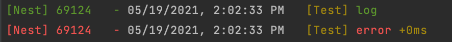
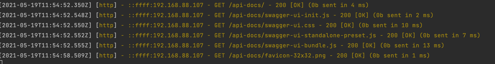
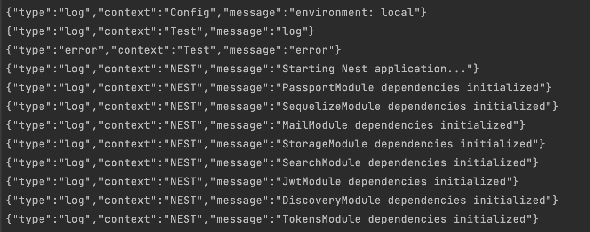

# nest-custom-logger
Provides logger and request middleware for NestJS and express application.

## Output examples
### Styled Example
#### Logs

#### Http logs

### Json Example
#### Logs

#### Http logs
```json
{"type":"http","context":"Request","message":"::ffff:192.168.88.107 - POST /auth/signin - 400 [Bad Request] (0b sent in 21 ms)","requestData":{"clientIp":"::ffff:192.168.88.107","method":"POST","originalUrl":"/auth/signin","statusCode":400,"statusMessage":"Bad Request","contentSize":0,"responseTime":21}}

```

## Usage

### Simple usage
```ts
import { Logger } from '@opengeekslab_llc/nest-custom-logger';

const logger = new (Logger(!process.env.NODE_ENV))('Hello');
logger.log('World')
```

### Usage in classes
```ts
function CustomLogger(context: string) {
  return new (Logger(!process.env.NODE_ENV))(context);
}

class Test {
  logger = CustomLogger('Test');

  run() {
    this.logger.log('log');
    this.logger.error('error');
  }
}
```

### Usage for not ts projects
```js
const { Logger } = require('@opengeekslab_llc/nest-custom-logger');

const logger = new (Logger(!process.env.NODE_ENV))('Hello');
logger.log('World')
```

### Usage of middleware for express
```js
const express = require('express');
const { requestLoggerMiddleware } = require('@opengeekslab_llc/nest-custom-logger');
const app = express();

const requestWriteLogs = CustomLogger('Request');

const requestLogger = requestLoggerMiddleware({
    writeLog: requestWriteLogs.http,
});

app.use(requestLogger);
```

### Real usage
```ts
import { NestFactory } from '@nestjs/core';
import { AppModule } from './app.module';
import { CustomLogger, requestLogger } from '@opengeekslab_llc/nest-custom-logger';

const port = 8000;

async function bootstrap() {
  const logger = CustomLogger('NEST');

  const app = await NestFactory.create(AppModule, {
    logger,
  });

  // use this middleware to show http logs in your console
  app.use(requestLogger);

  await app.listen(port);

  logger.log(`app is listening on port ${port}`);
}

bootstrap();
```
